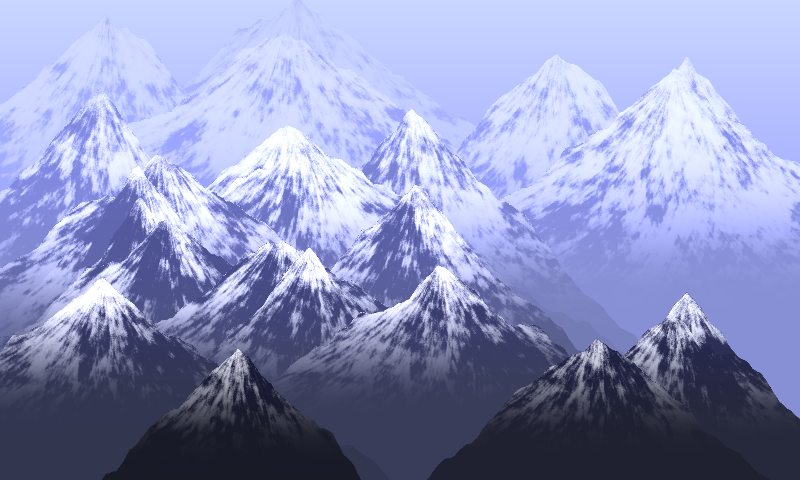

# maths_mountain

A Python script that mathematically generates a PNG of mountains based on the work of [Hamid Naderi Yeganeh](https://x.com/naderi_yeganeh).



## Background

Hamid Naderi Yeganeh is a mathematical artist who creates photorealistic images using pure mathematical equations — no 3D engines, no image editors, just formulas evaluated pixel by pixel.

In April 2025, Hamid posted an image of snow-capped mountains drawn entirely with mathematical equations, along with the formulas used to generate them. [Yusuf (@YusufAsunmogejo)](https://x.com/YusufAsunmogejo) saw the post and [publicly attempted to reverse-engineer the formulas](https://x.com/YusufAsunmogejo/status/2048106538376569037) from the image, successfully identifying 12 of the 14 mathematical objects but unable to read the two most complex functions (J_s and K_v) at the available resolution.

Inspired by Yusuf's attempt, I manually transcribed all 14 formulas from the original image by zooming in and pattern-matching individual glyphs character by character. The transcriptions were then implemented in Python with the help of Claude Opus 4.6 (Anthropic) and GPT-5.5 extended-thinking (OpenAI).

## How it works

The image is 2000×1200 pixels. For each pixel, the script:

1. Maps pixel coordinates (m, n) to mathematical coordinates (x, y)
2. Evaluates a fractal noise envelope E(x,y) from 50 summed cosine terms
3. Computes 23 mountain layer shapes J_s using double-exponential gating
4. Builds occlusion masks Z_s so foreground mountains hide background ones
5. Calculates depth (R), distance (T), slope angle (B), brightness (A), and snow coverage (C)
6. Evaluates a 50-term lighting kernel K_v for directional shading
7. Combines everything into colour channels H_v with atmospheric perspective
8. Applies a colour compression function F to map values to RGB [0, 255]

All of this is pure mathematics — trigonometric functions, exponentials, summations, and products. No textures, no meshes, no ray tracing.

## Usage

```bash
pip install numpy pillow
python mountains.py
```

Generates `mountains.png` (2000×1200) in the current directory. Takes roughly 40 seconds on a modern CPU.

## Credits

- **[Hamid Naderi Yeganeh](https://x.com/naderi_yeganeh)** — Original mathematical artist and creator of the mountain formulas
- **[Yusuf (@YusufAsunmogejo)](https://x.com/YusufAsunmogejo)** — Whose [public reverse-engineering attempt](https://x.com/YusufAsunmogejo/status/2048106538376569037) inspired this project
- **Eden (Phillip C. O'Brien)** — Formula transcription from source image
- **Claude (Anthropic) & GPT-5.5 (OpenAI)** — Code implementation assistance

## License

MIT — see [LICENSE](LICENSE) for details.

The mathematical formulas themselves are the creative work of Hamid Naderi Yeganeh. This repository contains an independent implementation based on visual transcription of publicly shared equations.
